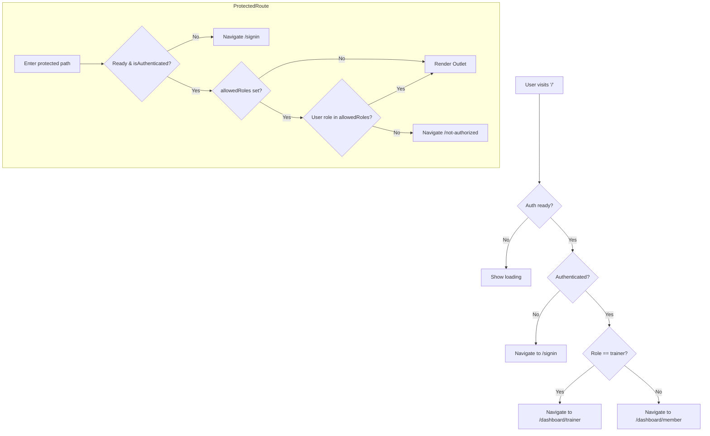

# Gym Frontend App — Application Overview

## Overview and Purpose
The Gym Frontend App is a React-based web client for the Gym Management System. It provides members and trainers with authenticated access to schedules, memberships, bookings, payments, progress tracking, and trainer workflows. The application integrates with a FastAPI backend and supports Supabase v2 for authentication. It uses a “runtime-config” pattern to allow deployment-specific configuration without rebuilding.

The user experience follows a classic, Ocean Professional theme with a top navigation bar, a persistent sidebar, and modular content cards. Role-aware routing and guards ensure members and trainers see the correct dashboards and tools.

## Key Features
- Authentication and session management via Supabase v2 (@supabase/supabase-js).
- Role-based access control for members and trainers using a centralized ProtectedRoute.
- Runtime configuration via public/app-config.json with environment variable fallbacks.
- API access patterns built around fetchWithAuth injecting Supabase access tokens.
- Responsive dashboard layout: Navbar, Sidebar, main content area using modular cards.
- Functional domains: memberships, classes, trainers, bookings, payments (checkout result), notifications, progress tracking, and trainer workflows (clients, workout templates, program builder).
- Developer-focused error handling and safe stubs for missing environment variables to avoid opaque failures.

## User Roles and Flows
The app supports at least the following roles:
- Member: Access to member dashboard, schedule, progress, notifications, and general dashboard content.
- Trainer: Access to trainer dashboard, client management, workout templates, program builder, notifications.
- Admin: Placeholder support exists via role checks; admin-specific routes are not defined in the current code paths.

Authentication and routing behavior:
1. Unauthenticated visit to “/”:
   - RootRedirect checks auth state and sends users to “/signin” when not authenticated.
2. Authenticated visit to “/”:
   - RootRedirect reads the role from the AuthContext and redirects to “/dashboard/member” or “/dashboard/trainer”.
3. Protected routes:
   - ProtectedRoute checks ready/loading, then isAuthenticated. If unauthorized, it redirects to “/signin”.
   - If allowedRoles is specified and the user’s role is not allowed, it redirects to “/not-authorized”.
4. Role derivation:
   - Defaults to Supabase user metadata and/or backend profile from /api/me (see AuthContext.jsx).
   - Role-based redirect logic sends users to the correct dashboard on login.

## UI/UX and Styling
- Theme: Ocean Professional (classic, polished, professional).
- Layout: 
  - Top navigation bar (Navbar).
  - Left sidebar (Sidebar) with dashboard and feature areas.
  - Main content area with clearly sectioned cards and panels.
- Visual components:
  - Reusable design system primitives (Button, Card, Sidebar) and related tokens under src/design-system and src/styles.
- Accessibility:
  - Loading states on ProtectedRoute and RootRedirect prevent flicker and premature redirects.
- Demo banner:
  - Optional DemoBanner shows test/demo status, including a quick reset data action when enabled via env.

## Routing Structure
Routes are defined in src/App.js using react-router-dom v6:

- Public
  - /overview, /memberships, /trainers
  - /signin, /signup
  - /auth/callback, /auth/error
- Authenticated (ProtectedRoute)
  - /dashboard → RoleDashboard (redirects to /dashboard/member or /dashboard/trainer)
  - /dashboard/memberships
  - /dashboard/classes
  - /dashboard/trainers
  - /dashboard/bookings
  - /checkout/result
  - /account
- Notifications (ProtectedRoute with allowedRoles [member, trainer])
  - /notifications
- Member-only (ProtectedRoute with allowedRoles [member])
  - /dashboard/member
  - /dashboard/member/schedule
  - /dashboard/member/progress
- Trainer-only (ProtectedRoute with allowedRoles [trainer])
  - /dashboard/trainer
  - /dashboard/trainer/clients
  - /dashboard/trainer/workouts/templates
  - /dashboard/trainer/workouts/program-builder
- Fallback
  - * → Not Found card

RootRedirect uses the AuthContext to redirect to role-specific dashboards and to gate unauthenticated users.

## State Management and Auth Context
- Canonical provider and hooks are centralized in src/context:
  - Barrel export: src/context/index.js
  - Canonical TS context: src/context/AuthContext.tsx
  - Legacy JS context for backward compatibility: src/context/AuthContext.jsx (used by some code paths for profile loading and backend-derived role)
- Key hooks and values (from canonical TS context):
  - session, user, loading, ready, isAuthenticated, role
  - signInWithEmail(email magic link), signInWithGoogle (optional, if configured), signOut
- Legacy context (JS) adds:
  - profile (from backend /api/me), role derived from backend
  - signIn(email, password) (Supabase email/password), signUp, getAccessToken, etc.
- Guarding routes:
  - ProtectedRoute.tsx uses useSupabaseAuth() to check authentication and roles, returning Outlet or Navigate.

Recommendation: Prefer importing AuthProvider and hooks from the context barrel (src/context) to avoid mismatches between the TS and JS contexts. The codebase already enforces this pattern in src/index.js and src/App.js.

## API Client and Data Access Patterns
- Supabase-backed token injection: src/api/client.ts provides fetchWithAuth which:
  - Attaches Bearer Authorization header using supabase.auth.getSession().
  - Handles a single refresh attempt on 401, then signs out and redirects to /signin on subsequent 401.
  - Uses a recursion guard (X-Internal-Request) and captures the native fetch once to avoid reentrancy issues.
- JS interop: src/api/client.js re-exports from client.ts for JS consumers.
- Usage:
  - Feature pages call fetchWithAuth or use explicit endpoints via fetch to the backend. Some pages use services/apiClient.js for base URL or Axios; however, fetchWithAuth is the canonical authenticated fetch pattern for Supabase.

## Supabase v2 Authentication
- Client factory: src/lib/supabaseClient.ts builds a singleton Supabase client using:
  - REACT_APP_SUPABASE_URL
  - REACT_APP_SUPABASE_KEY
  - Includes robust fallback resolution for malformed env keys found in the container (double prefixes like REACT_APP_REACT_APP_*).
  - If missing, provides a safe stub that throws clear errors when auth methods are invoked.
- Helper wrappers:
  - signInWithEmailPassword(email, password)
  - signInWithProvider(provider, redirectTo)
  - signOut()
  - getSession(), getUser()
- Context integration:
  - AuthContext.tsx (canonical) and AuthContext.jsx (legacy) subscribe to auth state and expose role & ready flags to prevent UI flicker.
- OAuth redirect:
  - For provider sign-in, redirectTo is derived from REACT_APP_GOOGLE_OAUTH_REDIRECT_URI or REACT_APP_SITE_URL + /auth/callback.

Backend compatibility:
- The backend can validate Supabase JWTs when SUPABASE_URL is set (per backend README). The frontend passes Supabase access tokens to backend endpoints via Authorization: Bearer.

## Environment and Runtime Configuration
Runtime configuration:
- At startup, src/config/runtimeConfig.js fetches /app-config.json and sets window.__APP_CONFIG__.
- If app-config is present, keys like API_BASE_URL, GOOGLE_CLIENT_ID, SUPABASE_URL, SUPABASE_KEY can be set at runtime without rebuilding.
- Fallback to process.env is used if app-config fields are absent.

Canonical environment variables:
- REACT_APP_API_BASE_URL (e.g., http://localhost:3001/api/v1)
- REACT_APP_SUPABASE_URL
- REACT_APP_SUPABASE_KEY
- REACT_APP_GOOGLE_CLIENT_ID (optional; enables Google sign-in UI)
- REACT_APP_SITE_URL (used for Supabase email redirect to /auth/callback)
- REACT_APP_APP_ENV (ui label)
- REACT_APP_TEST_MODE (demo/test toggles)

Current .env issue (from container_env):
- The environment has duplicates/malformed keys like:
  - REACT_APP_REACT_APP_GOOGLE_CLIENT_ID, REACT_APP_REACT_APP_SUPABASE_URL, REACT_APP_REACT_APP_SUPABASE_KEY, and triple-prefixed variants.
- The codebase includes guards to resolve such keys where possible, but normalization is strongly recommended (see Best Practices).

## Backend Integration and Security
- Base URL:
  - Derived from REACT_APP_API_BASE_URL or runtime config API_BASE_URL, defaulting to http://localhost:3001/api/v1 if not provided (see README).
- Auth:
  - Supabase access tokens are attached by fetchWithAuth.
  - Backend can validate Supabase JWT using its SUPABASE_URL JWKS discovery (per backend auth notes).
- Role resolution and /api/me:
  - The legacy AuthContext.jsx fetches /api/me to derive role and profile from the backend for role-based redirects and UI.

CORS and preview domains:
- Ensure backend CORS_ALLOW_ORIGINS includes the frontend origin(s), including local dev and preview domains as needed.

## Previews and Build Behavior
- React Scripts build, CRA conventions:
  - start: PORT is overridable (default 3000).
  - build/test/eject supported.
- Runtime-config allows changing endpoints and provider IDs without rebuild by updating public/app-config.json.
- Loading/ready gates prevent route flicker during initial app-config and session bootstrap.

## Project Structure Highlights
- src/index.js: App bootstrap, loads runtime config, mounts AuthProvider.
- src/App.js: Router definitions, role-aware redirects, guard composition.
- src/context:
  - index.js: Barrel exports; import from here across the app.
  - AuthContext.tsx: Canonical Supabase v2 auth provider.
  - AuthContext.jsx: Legacy provider that augments with backend /api/me profile and role.
- src/lib/supabaseClient.(ts|js): Client factory, helpers, and safe stubs.
- src/api/client.(ts|js): fetchWithAuth with token injection and graceful 401 handling.
- src/pages: Feature areas for Member, Trainer, and Dashboard domains.
- src/styles, src/design-system: Theme tokens and presentational primitives for Ocean Professional styling.

## Quickstart: Local Dev and Preview
1. Backend
   - Start the backend on http://localhost:3001 and ensure CORS allows http://localhost:3000.
   - Optionally set SUPABASE_URL in the backend to enable Supabase JWT validation.
2. Frontend .env
   - Create gym_frontend_app/.env with at least:
     - REACT_APP_API_BASE_URL=http://localhost:3001/api/v1
     - REACT_APP_SUPABASE_URL=https://YOUR-PROJECT.supabase.co
     - REACT_APP_SUPABASE_KEY=YOUR_PUBLIC_ANON_KEY
     - REACT_APP_SITE_URL=http://localhost:3000
     - Optionally REACT_APP_GOOGLE_CLIENT_ID if enabling provider login.
3. Optional runtime overrides
   - Create gym_frontend_app/public/app-config.json:
     {
       "API_BASE_URL": "http://localhost:3001/api/v1",
       "SUPABASE_URL": "https://YOUR-PROJECT.supabase.co",
       "SUPABASE_KEY": "YOUR_PUBLIC_ANON_KEY",
       "GOOGLE_CLIENT_ID": "optional-google-client-id"
     }
4. Install and run
   - npm install
   - npm start
   - Open http://localhost:3000
5. Sign-in flow
   - Email magic link: use the Login or SignIn page depending on route.
   - Email/password: supported via signInWithPassword if you wire the UI (see helpers).
   - Google provider: enable if REACT_APP_GOOGLE_CLIENT_ID is configured and Supabase Auth Providers are set.

## Operational Notes and Best Practices
- Use the context barrel: Always import AuthProvider and hooks from src/context to avoid accidental use of the legacy context types.
- API calls: Prefer fetchWithAuth for backend requests that require auth so tokens are attached consistently and 401 flows are normalized.
- Runtime-config first: If deploying to multiple environments, rely on app-config.json to avoid rebuilds. Maintain a small .env for base defaults.
- Roles: The frontend will default to role “member” where not specified. For precise role gating, rely on /api/me and ensure backend returns role.
- CORS and redirect URIs:
  - Include all preview and production frontend origins in backend CORS_ALLOW_ORIGINS.
  - Configure Supabase Auth redirect URLs to include SITE_URL/auth/callback for your environment(s).

## Known Issues and Next Steps
- Environment duplication:
  - The workspace contains many duplicated/malformed REACT_APP_* keys (e.g., REACT_APP_REACT_APP_*). The code implements fallback resolution, but this is fragile and can mask misconfiguration. Normalize the .env file as soon as possible.
- Mixed contexts:
  - Both TS and JS AuthContexts exist. The current import pattern consolidates via the barrel, but legacy imports could accidentally import the wrong context in future changes. Enforce the barrel import via lint rules or codemods.
- GitHub OAuth:
  - Utilities exist for GitHub OAuth (utils/githubOAuth.js, config/oauth.js), but backend support/redirects must be fully configured. Treat as experimental until the backend endpoints are enabled.
- Role sourcing:
  - Some pages derive role from Supabase user metadata while others rely on /api/me. Ensure consistent source of truth (prefer backend /api/me) for robust authorization decisions.

## Actionable Recommendations: Env Cleanup and Auth Usage
- Normalize .env keys:
  - Remove duplicated or malformed variables such as REACT_APP_REACT_APP_* or triple-prefixed variants.
  - Keep the canonical set only:
    - REACT_APP_API_BASE_URL
    - REACT_APP_SUPABASE_URL
    - REACT_APP_SUPABASE_KEY
    - REACT_APP_GOOGLE_CLIENT_ID (optional)
    - REACT_APP_SITE_URL
    - REACT_APP_APP_ENV (optional)
    - REACT_APP_TEST_MODE (optional)
- Prefer runtime-config where possible:
  - Create public/app-config.json per environment to avoid rebuilds. Only use .env as a fallback.
- Standardize auth usage:
  - Use AuthProvider and hooks from src/context and ProtectedRoute for route gating.
  - Use fetchWithAuth for all authenticated backend calls.
  - For provider login, configure Supabase Auth Providers, set redirect URLs, and ensure REACT_APP_SITE_URL points to your deployment origin(s).
- Backend alignment:
  - Ensure backend SUPABASE_URL is set so JWTs from Supabase are validated server-side.
  - Expose /api/me consistently and include role in the response to serve as the source of truth for role-based UI.

## Mermaid: High-level Route and Guard Flow

## References
- Frontend Entry and Routing:
  - src/index.js
  - src/App.js
  - src/components/ProtectedRoute.tsx
- Auth Context:
  - src/context/index.js
  - src/context/AuthContext.tsx
  - src/context/AuthContext.jsx
- Supabase Client and Helpers:
  - src/lib/supabaseClient.ts
  - src/lib/supabaseClient.js
- API Client:
  - src/api/client.ts
  - src/api/client.js
- Runtime Config:
  - src/config/runtimeConfig.js
- Representative Feature Pages (examples):
  - src/pages/Member/MemberDashboard.jsx
  - src/pages/Member/Progress.jsx
  - src/pages/Trainer/TrainerDashboard.jsx
  - src/pages/Trainer/Workouts/Templates.jsx
  - src/pages/Trainer/Workouts/ProgramBuilder.jsx
  - src/pages/Dashboard/Memberships.jsx
  - src/pages/Dashboard/Classes.jsx
  - src/pages/Dashboard/Trainers.jsx
  - src/pages/Notifications.jsx

